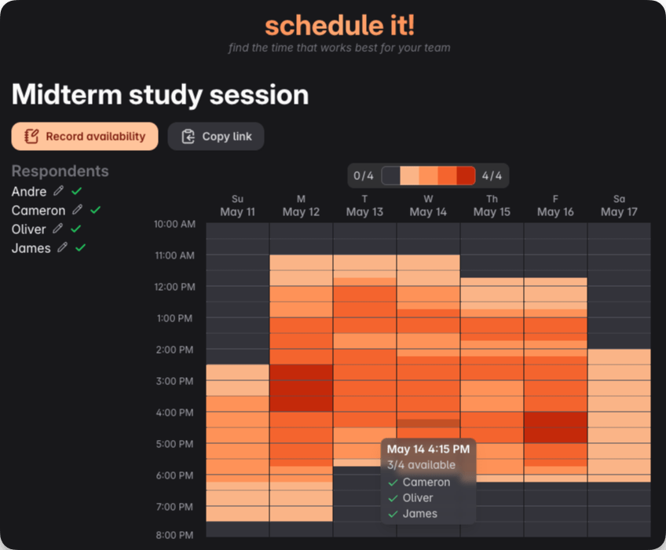

# ⏰ schedule it!

A web app built to make finding the best time to meet with your friends or team members easier. Made by [cameron](https://github.com/wzid) and [andre](https://github.com/aelew).

Try it yourself at [scheduleit.now](https://scheduleit.now)!



## Built with

- 🥟 Bun
- 🌎 Vercel
- 🔥 Svelte 5
- 🧩 TypeScript
- 🎨 Tailwind CSS
- 🌧️ Drizzle ORM
- 🌀 Upstash Redis

## Development

Clone the project

```bash
git clone https://github.com/wzid/scheduleit
```

Go to the project directory

```bash
cd scheduleit
```

Install dependencies

```bash
bun i
```

Set environment variables

```bash
To run this project, you need to set the required environment variables. Copy `.env.example` into a new file called `.env` and fill in the values.
```

Start the local development server at http://localhost:5173

```bash
bun dev
```
